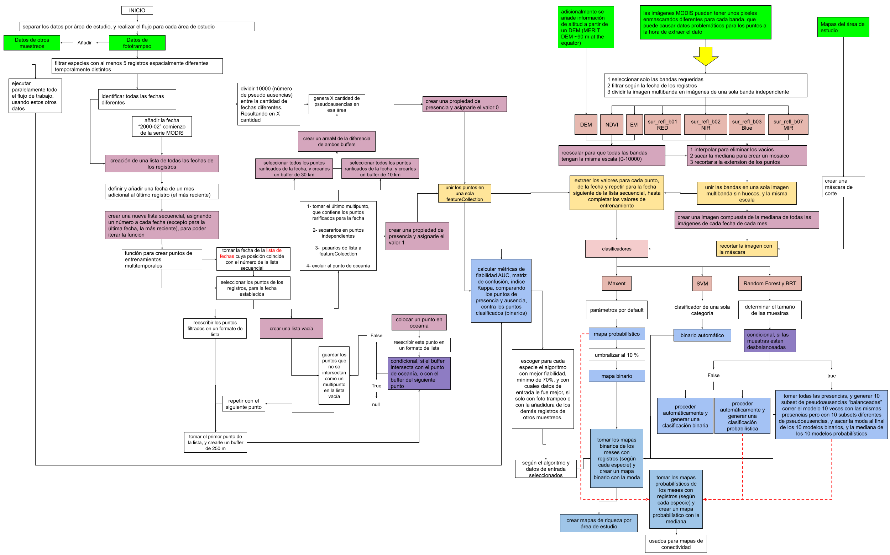

# BioModelos Regionalizados: modelos de distribución calculados para especies con registros y fecha del evento, con aplicación a aves. 

BioModelos es un sistema colaborativo en línea para mapear distribuciones de especies (Velásquez-Tibata et al, 2019), cuya misionalidad es ser el Atlas de la Biodiversidad de Colombia útil para la investigación y toma de decisiones. Este repositorio almacena las funciones implementadas para el calculo de modelos de nicho ecológico y la construcción de modelos de distribución potencial de especies registradas con cámaras trampa. Estos modelos fueron entrenados y proyectados multitemporalmente (meses), a partir de datos satelitales MODIS y registros obtenidos a en campo con cámaras trampa. La integración de las dos fuentes de información se desarrolló usando rutinas de jscript en Google Earth Engine (GEE).

*El flujo de datos y procesos implementados para la obtención de los modelos, tanto en formato de idoneidad de hábitat como distribución potencial, se encuentran sintetizado en la siguiente figura:*


Para ejecutar las funciones se debe seguir la siguiente secuencia:

* Verificar que todos los registros tengan el formato de fecha estandarizado de la siguiente forma (Año-mes-día). Por ejemplo: ‘2020-12-16’
* 1. Crear el dataset de entrenamiento
* 1.1 crear las imágenes mensuales MODIS para proyectar el modelo (solo toca ejecutar este paso una vez, de resto se puede comentar la parte del código que hace este proceso)
* 2. Ejecutar la modelación de las especies usando 4 algoritmos distintos (Máxima entropía MaxEnt, Random forest RF, boosted Regression Trees BRT y Support Vector Machine SVM). Esto producirá 3 salidas (mapas binarios, mapas probabilísticos, y tabla de datos para evaluar la fiabilidad de las modelaciones)
Esto producirá 3 salidas (mapas binarios, mapas probabilísticos, y tabla de datos para evaluar la fiabilidad de las modelaciones)
* 3. Ejecutar las pruebas de fiabilidad 
* 4. Generar mapas de idoneidad de hábitat 
* 5. Generar mapa binario a partir del modelo de idoneidad de hábitat 
* 6. Generar mapa de riqueza  

Estado Actual: primera versión.

## Prerrequisitos

### Google Earth Engine (GEE)

Los siguientes códigos fueron escritos en GEE de modo que para ejecutarlos es indispensable tener un usuario autorizado en dicha plataforma. GEE es de uso gratuito para investigación publica y docencia, y solo algunos casos específicos requieren una licencia.


En este link se puede aprender de las generalidades de GEE y conocer a profundidad sus usos y alcances: https://earthengine.google.com/ Para registrarse recuerde dar click en el botón “Sing Up”, y seguir los pasos que le dará la plataforma GEE

Ya teniendo el usuario autorizado se puede acceder al editor de código a través del siguiente link: https://code.earthengine.google.com/


En este otro link hay algunas explicaciones de cómo programar en GEE https://developers.google.com/earth-engine/guides/getstarted


### Assets
Todos los datos subidos y productos generados se guardaran en los “assets” de GEE que es una nube virtual privada (distinta a google Drive o a Google cloud, estos archivos son solo accesibles a través de GEE, no pueden subirse ni descargarse sin usar GEE)

Es necesario generar las siguientes carpetas cuando vaya a correr las rutinas, ya que en ellas se alamcenaran los resultados generados en cada paso:

* '*Nombre del área de estudio*'
  * '*ROC*'
  * '*binario*'
  * '*binarioMensual*'
  * '*conectividad*'
  * '*probabilisitico*'
  * '*training*'
* '*inputs*'
* '*modis*'
 

### Data

Antes de usar los códigos es importante haber subido a GEE los registros de las especies que se desean modelar, siguiendo el formato de fehca mencionado previamente.

Es importante recordar que los códigos aquí descritos se deben modificar con las rutas de dirección y los nombres de los archivos según el usuario.

**Inputs**

Los siguientes archivos deben ser subidos en la carpeta inputs:

1. areas_estudio: es una FeatureCollection que contiene en formato vectorial tipo shape, los polígonos de las áreas de estudio, (cada área debe ser un vector diferente, un multipoligono deberá ser separado en polígonos independientes), este archivo debe tener un atributo (columna) con un nombre de área de estudio estandarizado (sin espacios). (Si el nombre no es estandarizado implicara modificar manualmente todas las direcciones de archivos dentro de los códigos).

2. registros, es una FeatureCollection que contiene en formato vectorial tipo shape, los puntos dentro de las áreas de estudio, con los registros de las especies, estos registros deben tener los siguientes atributos (columnas):
    * Nombre científico corectamente escrito: Género + epíteto específico
    * Fecha en formato estandarizado ‘2020-12-16’ estos registros deben estar separados por área de estudio (de modo que habrá tantos archivos de registros como áreas de estudio), y el nombre de estos archivos debe ser el nombre estandarizado del área de estudio.


## Ejecutar

- Los códigos deben ser ejecutados de manera secuencial por eso los scripts están numerados.

- Dentro de cada script hay líneas cometidas, que explican que hace cada comando

- Se debe esperar a que las tareas de un script terminen de ser ejecutadas, antes de correr las tareas del siguiente.
- Hay secciones del código que no se debe correr siempre. Por lo tanto, pueden ser comentadas o no ejecutadas. Estas son:

  - los Export: Los Export: la mayoría de scripts exportar resultados a los assets o al Drive, cada usuario puede decidir si guarda esos archivos en su drive. Necesariamente, los resultados serán almacenados en sus assets.
  - Hay secciones del código que generara errores, pero no evitaran que se ejecuten las funciones, (estos errores son más bien advertencias cuando se visualizan los mapas en el panel de mapas). Estas partes del código serán señaladas.

1. Se generaron 2 tipos de modelos con 2 diferentes sets de datos. Los datos de entrenamiento pueden ser registros de foto trampeo exclusivamente "FOTO" o registros de foto trampeo con registros adicionales de otros muestreos "TODOS". Esto permitirá generar los mejores modelos posibles. Igual posteriormente la evaluación permitirá evaluar matemáticamente el rendimiento de los modelos o ser usados para acompañar el criterio experto en el análisis posterior de los modelos.
  * 1.1 Copiar el código. "1.1 entrenamiento"” en el editor de código de GEE
  * 1.2 Buscar en el código la parte que dice (cerca de la línea 355:

```java
/*
// Esta sección de código, es para exportar las imágenes sobre las cuales se generaran los modelos
// year determina la fecha de la imagen a exportar, puede ser mes 'xxxx_xx' o año 'xxxx'
// Modis_predict filtra las imágenes modis de la lista 'modis_interpolado' que coincide con la 
// fecha indicada
// export exporta la imagen a los assets
//activar solo una vez al principio del flujo de trabajo
var year = '2020_12'; 
var Modis_predict = ee.ImageCollection(modis_interpolado).filterMetadata('id', "contains", year).median();
Export.image.toAsset({
  image: Modis_predict, 
  description: 'modis_predict'+year, 
  assetId: 'ecopetrol/modis_predict_'+year,
  region: colombia, 
  scale:250, })
*/
```
Para activar el código eliminar las primera y última línea que contienen los símbolos: /* */
```java
// Esta sección de código, es para exportar las imágenes sobre las cuales se generaran los modelos
// year determina la fecha de la imagen a exportar, puede ser mes 'xxxx_xx' o año 'xxxx'
// Modis_predict filtra las imágenes modis de la lista 'modis_interpolado' que coincide con la 
// fecha indicada
// export exporta la imagen a los assets
//activar solo una vez al principio del flujo de trabajo
var year = '2020_12'; 
var Modis_predict = ee.ImageCollection(modis_interpolado).filterMetadata('id', "contains", year).median();
Export.image.toAsset({
  image: Modis_predict, 
  description: 'modis_predict'+year, 
  assetId: 'ecopetrol/modis_predict_'+year,
  region: colombia, 
  scale:250, })
```

Una vez identificado este bloque de texto, activarlo eliminando la primera línea y la última como se indica en la siguiente imagen:
  
  
Una vez activo se deberá cambiar el valor del mes que se quiere como se muestra a continuación y ejecutar el código, este paso se deberá repetir cambiando el valor de la fecha indicada para cada vez que se quiere modelar (en este caso se ejecuta 12 veces por ejemplo para los 12 meses del 2020) Una vez se ejecutaron y guardaron los mosaicos de MODIS que se utilizaran para proyectar los modelos, se debe proceder a comentar este bloque de texto (no se volverá a utilizar) Y continuar con el siguiente paso.
  
  
  * 1.3 Ejecutar el código para cada especie, y para cada área de estudio (USANDO LOS REGISTROS DE FOTOTRAMPEO), estos resultados se guardarán en el folder ‘training’, y tendrán el prefijo ‘foto’ significando que estos serán los datos de entrenamiento usando solo los datos de foto trampeo
  
  * 1.4 Copiar el código “1b.entrenamineto2” en el editor de código de GEE.
  * 1.5 Ejecutar el código para cada especie, y para cada área de estudio (USANDO LOS REGISTROS DE FOTOTRAMPEO MAS LOS DE OTROS MUESTREOS), estos resultados se guardaran en el folder ‘training’, y tendrán el prefijo ‘todos’ significando que estos serán los datos de entrenamiento usando los datos de foto trampeo más registros adicionales de otros muestreos
  
2. modelar las especies
  * 2.1 Copiar el código "*2.modelacionCompleta*" en el editor de código de GEE
  * 2.2 Ejecutar el código para cada especie, en cada área de estudio, con cada uno de los datos de entrenamiento (TODOS y FOTO), este código generara en cada corrida 3 task para ejecutar, uno serán los modelos probabilísticos mensuales (guardados en la carpeta probabilístico), otro los modelos binarios mensuales (guardados en la carpeta binarioMensual) y el otro los datos para evaluar los modelos (guardados en la carpeta ROC). Este código pude demorar unos segundos en generar los 3 tasks

3. Evaluar la fiabilidad o rendimientos de los modelos 
  * 3.1 Copiar el código '*3.fiabilidad*' en el editor de código de GEE
  * 3.2 Este código se debe ejecutar para cada área de estudio, con cada uno de los datos de entrenamiento (TODOS y FOTO), es importante recalcar que para cada área de estudio toca cambiar la lista de especies que se van a evaluar, correspondiendo a las especies con registro por área de estudio (es importante recalcar que este código no hace falta ejecutarlo para cada especie, sino solo por área de estudio), esta tabla se guardara en la carpeta de cada área de estudio (al final deben de haber 2 tablas de fiabilidad por área de estudio (TODOS y FOTO))
  * 3.3 Es importante revisar esa tabla y las métricas de cada modelo para poder seleccionar los modelos adecuados, nuestro criterio para determinar modelos aceptables fue que tuvieran un valor de AUC igual o mayor a 0.7. 
  
    Hubo especies que no tuvieron ningún modelo que cumpliera ese requisito, por lo tanto esas especies no se les hizo modelo de conectividad. Así mismo hubo especies con varios modelos que superaban el umbral de 0.7.En esos casos se usó criterio experto para determinar el mejor modelo para cada especie en cada área de estudio (ver el paso siguiente).

4.Generar modelo de idoneidad de hábitat o de idoneidad, este código tiene varios detalles que es importante prestar atención para generar correctamente el mapa. Además este código es posible que muestre errores en la consola, pero eso no impide que se genere el mapa, son más bien advertencias.

  * 4.1 Copiar el código '*4.MapaConec*'en el editor de código de GEE
  
  * 4.2 Es importante aclarar que no necesariamente todas las especies registradas con cámaras trampa tuvieron registros adicionales de otros muestreos, de modo que hay especies que solo fueron creados con registros de foto trampeo. En esos casos el código arrojará un error que dice algo similar a estos: 
```java
  List (Error)
  Collection.loadTable: Collection asset 'users/Biomodelos_Iavh/ecopetrol/RioTillava/training/todos_Tapirus_terrestris_training' not found.
  
  BRT TODOS: Layer error: Image.load: Image asset 'users/Biomodelos_Iavh/ecopetrol/RioTillava/probabilistico/todos_Tapirus_terrestris_MX_SVM_RF_BRT' not found.
  
  registros Todos: Layer error: Collection.loadTable: Collection asset 'users/Biomodelos_Iavh/ecopetrol/RioTillava/training/todos_Tapirus_terrestris_training' not found.
```
  
  Estos errores son advertencias que dicha especie para esa área de estudio no tiene datos de entrenamiento con registros adicionales, de modo que no se generaron los modelos con los datos “TODOS” pero no son errores que generen problemas. Así se verán este tipo de errores en la consola:
  
  
  * 4.3 De forma similar en el panel de capas en esos casos donde no hay modelos con datos “TODOS” aparecerán barras rojas en el administrador de capas, pues como esas capas no existen no pueden mostrarlas. Así se verán este tipo de errores en la consola:
  
  
        Si nos fijamos bien las capas que dicen TODOS son las que no se muestran y muestran error
  
  * 4.4 Este código se tiene que ejecutar AL MENOS 2 VECES por especie, para cada área de estudio.
  
    * 4.4.1 Antes de la primera ejecución se deberá revisar la tabla de fiabilidad creada en el paso anterior, para aquellas especies donde solamente hay un modelo aceptable (AUC mayor o igual a 0.7) entonces dicho modelo (BRT, RF, o MaxEnt) deberá ser escrito en la variable “modelo” como se muestra a continuación donde el modelo aceptable es BRT.
    
    
    * 4.4.2 La primera ejecución es para visualizar. Siempre es bueno verificar visualmente que el modelo seleccionado es aceptable desde el punto de vista estadístico y ecológico, para eso revisar el panel de capas y comparar el modelo seleccionado vs todos los demás como se muestra a continuación:
    
    
          Nótese que el modelo seleccionado es BRT foto, SIEMPRE EL MODELO SELECCIONADO APARECERA EN LA PRIMERA CAPA (si es foto) O EN LA CUARTA CAPA (si es todos) *SIEMPRE EL MODELO SELECCIONAO SERA EL QUE APARECE EN LA CAPA PRIMERA O CUARTA CON MAYUSCULAS EN FOTO Y/O EN TODOS*
          
    * 4.4.3 Luego se verifica de nuevo en la consola que el modelo sea el que se quiere exportar, siempre se imprimirá una frase para recordar verificar, en la que se muestra que tipo de modelo es el que se exportara (foto o todos) (BRT, MaxEnt, o RF
      
    
          Recuerda verificar en la línea 273 que confirmemos si se desea exportar el modelo "TODOS" o "FOTO", para cambiar en el código según corresponda.
      
    
    * 4.4.4 Una vez verificado el modelo y corregido el código se hará la segunda ejecución para exportar el modelo tanto al drive como a los assets (se recomienda en ambos, pero no es indispensable en el drive)
    4.4.5 Para especies que tengan ambos tipos de registros tipo FOTO y TODOS el código no debe presentar ningún error, y si toca escoger entre varios modelos buenos, en el panel de mapas se hacen las verificaciones visuales para decidir qué modelo usar con criterio experto. Y finalmente se exporta el modelo, aun así es importante hacer todas las verificaciones del código debe lucir así:
    
    
    
        Nótese las distintas verificaciones que se deben de hacer y que en una especie como la señalada que tiene datos tipo TODOS y FOTO el código no presenta error, además en este caso el modelo seleccionado es tipo TODOS y BRT.
          
5.Luego, se debe generar un mapa binario a partir del modelo de idoneidad de hábitat 

  * 5.1 Copiar el código ’5.BinarioConec’En el editor de código de GEE
  
  * 5.2 Este código para ejecutarse se debe verificar que las variables de entrada coincidan con el modelo de idoneidad generado en el paso anterior. Es decir, verificar que si se creó un modelo RF con datos TODOS. Luego, debe especificar esas mismas variables en la rutina.
  
        Este código se debe ejecutar por cada especie en cada área de estudio. En el panel de mapas mostrara los registros, el modelo de idoneidad y el binario resultante a partir del umbral determinado por la probabilidad menor de los registros (Mínimo valor de entrenamiento; el umbral se puede verificar en la consola).
      
  * 5.3 Este código se debe ejecutar los "exports", no es necesario exportar al drive pero se recomienda hacerlo.
  
6. mapa de riqueza

  * 6.1 El mapa de riqueza no tiene un script puntual, porque cada área tiene especies diferentes, entrenados con datos distintos (foto y todos) y con varios algoritmos (BRT, RF, y Maxent) de modo que las direcciones de los archivos varían mucho, y requieren ser modificadas para cada área.
  
  * 6.2 Sin embargo para generar el mapa de riqueza simplemente se importan todas las capas binarias y se suman.

    
## Autores y contacto

* **Gabriel Alejandro Perilla Suarez, [contacto institucional](mailto:gperilla@humboldt.org.co), [contacto personal](mailto:thealejandroperilla@gmail.com)** 

* **Elkin Alexi Noguera Urbano, [contacto institucional](mailto:enoguera@humboldt.org.co), [contacto personal](mailto:elkalexno@gmail.com)**

## Colaboradores

* **Carlos Jair Muñoz, [contacto institucional](mailto:cmunoz@humboldt.org.co ), [contacto personal](mailto:cmunoz@humboldt.org.co )** 

* **Luis Romero, [contacto institucional](mailto:lromero@humboldt.org.co ), [contacto personal](mailto:lromero@humboldt.org.co )**

* **Maria Helena Olaya, [contacto institucional](mailto:molaya@humboldt.org.co ), [contacto personal](mailto:molaya@humboldt.org.co )**
  
* **Cristian Cruz, [contacto institucional](mailto:ccruz@humboldt.org.co ), [contacto personal](mailto:cruzrodriguezcristian@gmail.com  )**


## Reconocimientos

Los desarrollos de estas rutinas fueron parcialmente finaciados por Ecopetrol para contrato de una persona experta en GEE, dentro de la estrategía de monitoreo usando modelos regionalizados en el Proyecto FIBRAS.

La plataforma BioModelos con los modelos regionalizados, hace parte de las estrategías del Instituto Humboldt, para monitorear especies e identificar la pérdida de hábitat casi en tiempo real.

Los desarrollos fueron particialmente incentivados dentro del proyecto BioModelos para integrar datos de sesores remotos en Google Earth Engine, con una beca dentro del programa Group on Earth Observations (GEO) - Google Earth Engine (GEE) que proporciona financiamiento para abordar desafíos ambientales y sociales utilizando datos abiertos de la Tierra.

Una aplicación GEE para las aves de Colombia surgió de este desarrollo y puede ser consultada en: [BioModelos GEE](https://biomodelos-iavh.users.earthengine.app/view/biomodelos) 

Mayor información relacionada con el proyecto encuentrala en: [GEO-GEE PROJECT: IDENTIFYING NEAR REAL-TIME LOSS HABITAT ALERTS](https://eodatascience.com/Newsroom/GEO-GEE-project-Identifying-near-real-time-loss-h) 

## Licencia

Este proyecto esta licenciado bajo la licencia MIT - revisar el archivo [License.md](License.md) para más detalles

